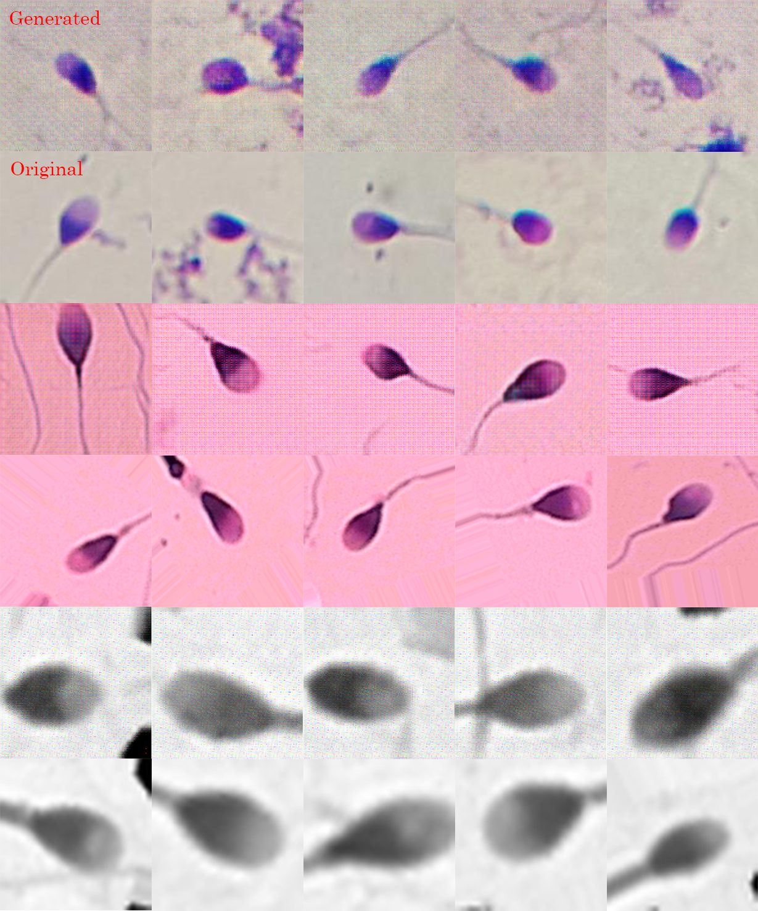
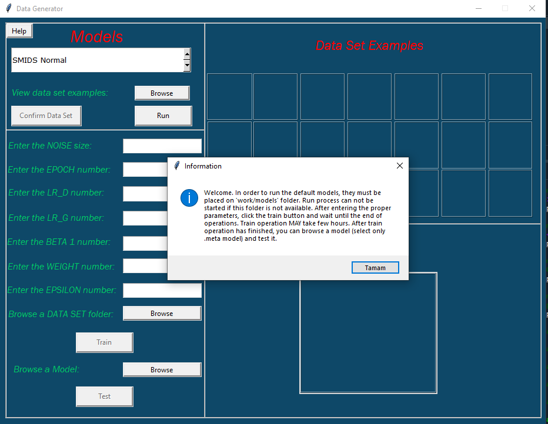
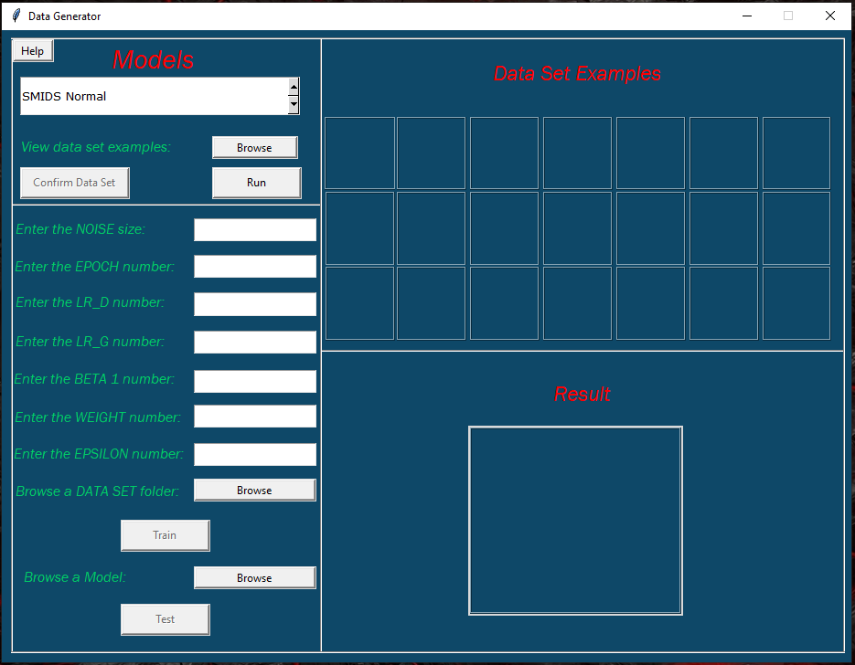
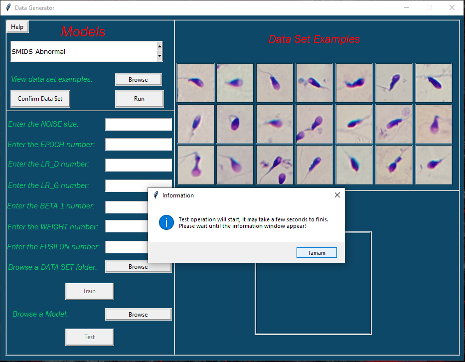
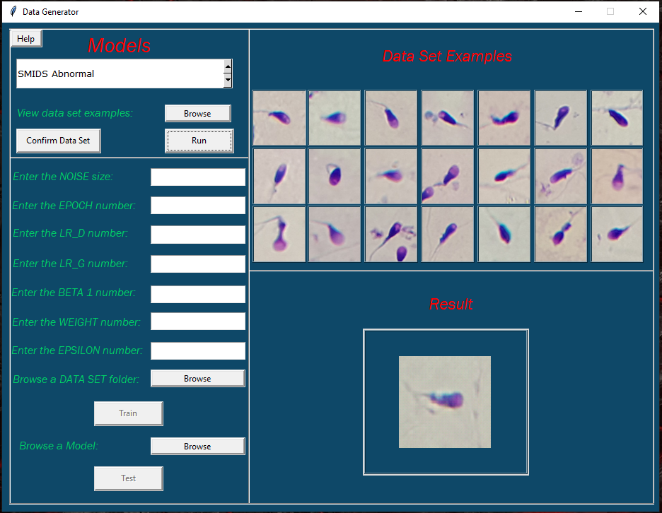
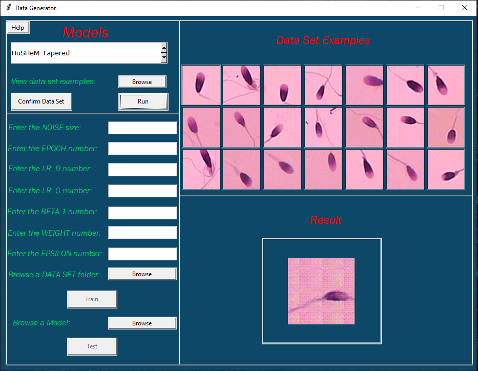

# <h1 align=center>Creating a General Data set from Different Image Sets Using GAN</h1>

[Paper](https://drive.google.com/file/d/1W_4d3xbCAv5mC64YAtd9-UBDYkdMX58K/view?usp=sharing)

Effective training of neural networks requires data in big quantity. Neural Networks trained in low data situations are poorly generalized and can lead to low accuracy in solving real-life problems. Data Augmentation alleviates this problem by using existing data more effectively. However, standard data augmentation only produces a limited number of useful alternative data. Considering the use of data augmentation to create more distinctive and diverse data, we train a generative model. This study was operated on one of the examples of Generative Adversarial Networks, DCGAN model. In this study, many different methods and optimizations techniques used for data augmentation are examined in detail, statistical results are compared with each other, and approaches given successful results are summarized.

### DCGAN

The deep convolutional generative adversarial network, DCGAN, is an extension of the GAN architecture for using deep convolutional neural networks for both the generator and discriminator models and configurations for the models and training that result in the stable training of a generator model. This structure is used in combination with Convolutional Neural Networks, CNN, and GAN networks. In the structure of the model that has been used in this study, unlike other adversarial neural networks, convolutional networks are used that replace deterministic pooling functions such as maxpooling with long convolutions. This model that directly connects the largest convolutional layers to the input and output of the generator and the discriminator in the basic structure of the GAN model has shown promising results in recent studies. Network architecture by [Radford et al., 2015](https://arxiv.org/abs/1511.06434).

### Performance Metric

Results of the trained models were calculated with Frechet Inception Distance, FID for short. FID is an objective metric that calculates the distance between feature vectors of real and artificially generated images. This metric involves the use of InceptionV3 model, a pre-trained deep learning neural network for image classifications. A low FID value indicates that the two image datasets are similar or have more similar statistics.

 The FID value is expressed as *d^2*. *m* and *mw* represent the average of the real and generated images in terms of their properties. *C* and *Cw* are the covariance matrix for real and generated feature vectors called sigma. *Tr* corresponds to linear algebra operation.

### Results

### Desktop Application

### Authors

[Nihad Guluzade](https://github.com/nihadguluzade)

[Kamran Balayev](https://github.com/Kamran017)
